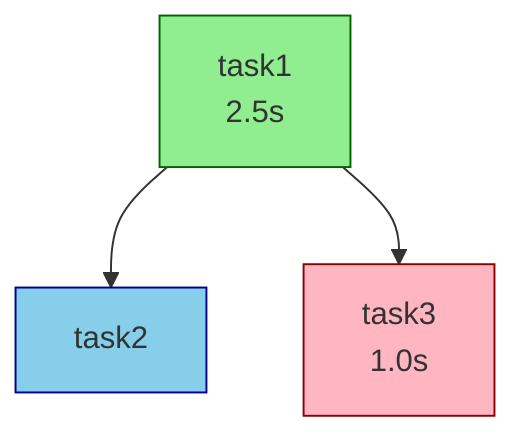
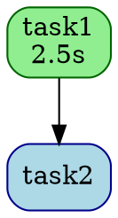

# Dynamic Orchestration System

A comprehensive orchestration framework for coordinating multi-agent workflows in the pydantic-deepagents library.

## Overview

The orchestration system provides powerful capabilities for defining, executing, and monitoring complex workflows that involve multiple agents working together. It handles task dependencies, dynamic routing, parallel execution, error handling, and progress tracking.

## Key Features

### 1. **Task Definition & Dependencies**
- Define tasks with explicit dependencies
- Support for complex dependency graphs (DAGs)
- Automatic topological sorting
- Circular dependency detection

### 2. **Dynamic Agent Routing**
- Route tasks to appropriate agents based on capabilities
- Load balancing across agents
- Priority-based agent selection
- Support for explicit agent assignment

### 3. **Multiple Execution Strategies**
- **Sequential**: Execute tasks one by one in order
- **Parallel**: Execute independent tasks concurrently
- **DAG**: Execute based on dependency graph with parallel execution
- **Conditional**: Execute tasks based on runtime conditions

### 4. **Error Handling & Resilience**
- Automatic retry with exponential backoff
- Configurable retry policies
- Continue-on-failure mode
- Comprehensive error tracking

### 5. **State Management**
- Real-time workflow state tracking
- Progress monitoring
- Task result aggregation
- Workflow history

### 6. **Agent Capabilities**
Predefined agent capabilities for intelligent routing:
- General purpose
- Code analysis
- Code generation
- Testing
- Debugging
- Documentation
- Data processing
- File operations
- API integration
- Research

### 7. **Skill Integration** ✨
- Automatic skill discovery and loading
- Tasks can specify required skills
- Skills auto-loaded when tasks execute
- Skills provide domain-specific expertise
- Seamless integration with existing skill system

### 8. **Performance Metrics & Analytics** 📊
- Automatic metrics collection for all workflows
- Task-level and workflow-level metrics
- Performance analysis and bottleneck identification
- Success rate and retry tracking
- Aggregate statistics across workflows
- Human-readable performance reports

### 9. **Workflow Templates** 🎯
- Pre-built templates for common patterns
- CI/CD pipeline template
- ETL data pipeline template
- Code review workflow template
- Documentation generation template
- Customizable and extensible

### 10. **Result Caching** ⚡
- Intelligent task result caching
- Multiple cache strategies (memory, disk, hybrid)
- Automatic cache key generation
- Dependency-aware caching
- TTL (time-to-live) support
- LRU eviction policy
- Cache statistics and monitoring

### 11. **DAG Visualization** 🎨
- Visual workflow representation
- Multiple output formats (Mermaid, Graphviz, ASCII, JSON)
- Status-aware coloring
- Execution metrics overlay
- Dependency graph visualization
- Export for documentation

## Architecture

### Core Components

#### 1. **TaskDefinition**
Defines a single task in a workflow:
```python
TaskDefinition(
    id="analyze-code",
    description="Analyze the codebase for potential issues",
    required_capabilities=[AgentCapability.CODE_ANALYSIS],
    required_skills=["python-code-review"],  # Auto-loaded skills
    depends_on=["setup"],  # Task dependencies
    priority=8,  # 1-10, higher is more important
    retry_config=RetryConfig(max_retries=3),
    parameters={"focus": "security"}  # Custom parameters
)
```

#### 2. **WorkflowDefinition**
Defines a complete workflow:
```python
WorkflowDefinition(
    id="ci-pipeline",
    name="Continuous Integration Pipeline",
    tasks=[task1, task2, task3],
    execution_strategy=ExecutionStrategy.DAG,
    max_parallel_tasks=5,
    continue_on_failure=False
)
```

#### 3. **TaskOrchestrator**
Main coordinator that executes workflows:
```python
orchestrator = TaskOrchestrator(agent, deps, config)
state = await orchestrator.execute_workflow(workflow)
```

#### 4. **StateManager**
Manages workflow execution state:
- Tracks task status (pending, running, completed, failed, skipped)
- Manages dependencies
- Provides progress information

#### 5. **TaskRouter**
Routes tasks to appropriate agents:
- Capability-based routing
- Load balancing
- Priority handling

#### 6. **Execution Strategies**
Different strategies for task execution:
- `SequentialExecutor`: One task at a time
- `ParallelExecutor`: All tasks concurrently (with limit)
- `DAGExecutor`: Dependency-aware parallel execution
- `ConditionalExecutor`: Condition-based execution

## Usage Examples

### Basic Workflow

```python
from pydantic_deep import (
    create_deep_agent,
    create_default_deps,
    TaskOrchestrator,
    WorkflowDefinition,
    TaskDefinition,
    ExecutionStrategy,
)

# Create agent
agent = create_deep_agent(model="openai:gpt-4")
deps = create_default_deps()

# Create orchestrator
orchestrator = TaskOrchestrator(agent, deps)

# Define workflow
workflow = WorkflowDefinition(
    id="simple-workflow",
    name="Simple Task Workflow",
    execution_strategy=ExecutionStrategy.SEQUENTIAL,
    tasks=[
        TaskDefinition(
            id="task1",
            description="Analyze requirements",
        ),
        TaskDefinition(
            id="task2",
            description="Generate implementation plan",
            depends_on=["task1"],
        ),
        TaskDefinition(
            id="task3",
            description="Create documentation",
            depends_on=["task2"],
        ),
    ],
)

# Execute workflow
result = await orchestrator.execute_workflow(workflow)
print(f"Workflow status: {result.status}")
print(f"Completed tasks: {len(result.completed_tasks)}")
```

### Parallel Execution

```python
workflow = WorkflowDefinition(
    id="parallel-analysis",
    name="Parallel Data Analysis",
    execution_strategy=ExecutionStrategy.PARALLEL,
    max_parallel_tasks=5,
    tasks=[
        TaskDefinition(
            id=f"analyze-{i}",
            description=f"Analyze dataset {i}",
            required_capabilities=[AgentCapability.DATA_PROCESSING],
        )
        for i in range(10)
    ],
)

result = await orchestrator.execute_workflow(workflow)
```

### Complex DAG Workflow

```python
workflow = WorkflowDefinition(
    id="web-app-dev",
    name="Web Application Development",
    execution_strategy=ExecutionStrategy.DAG,
    max_parallel_tasks=3,
    tasks=[
        # Phase 1: Requirements
        TaskDefinition(
            id="requirements",
            description="Define application requirements",
            priority=10,
        ),

        # Phase 2: Parallel development
        TaskDefinition(
            id="backend",
            description="Develop backend API",
            depends_on=["requirements"],
            required_capabilities=[AgentCapability.CODE_GENERATION],
            priority=8,
        ),
        TaskDefinition(
            id="frontend",
            description="Develop frontend UI",
            depends_on=["requirements"],
            required_capabilities=[AgentCapability.CODE_GENERATION],
            priority=8,
        ),

        # Phase 3: Integration
        TaskDefinition(
            id="integration",
            description="Integrate frontend and backend",
            depends_on=["backend", "frontend"],
            priority=7,
        ),

        # Phase 4: Testing
        TaskDefinition(
            id="testing",
            description="Run comprehensive tests",
            depends_on=["integration"],
            required_capabilities=[AgentCapability.TESTING],
            priority=6,
        ),

        # Phase 5: Documentation
        TaskDefinition(
            id="docs",
            description="Generate documentation",
            depends_on=["testing"],
            required_capabilities=[AgentCapability.DOCUMENTATION],
            priority=5,
        ),
    ],
)
```

### With Progress Tracking

```python
def progress_callback(state: WorkflowState):
    progress = orchestrator.get_workflow_progress(workflow.id)
    print(f"Progress: {progress['completed']}/{progress['total_tasks']} tasks")
    print(f"Status: {progress['status']}")

result = await orchestrator.execute_workflow(workflow, progress_callback)
```

### Custom Agent Routing

```python
from pydantic_deep.orchestration import (
    OrchestrationConfig,
    AgentRouting,
    create_default_routing,
)

config = OrchestrationConfig(
    agent_routing=[
        AgentRouting(
            agent_type="senior-developer",
            capabilities=[
                AgentCapability.CODE_GENERATION,
                AgentCapability.CODE_ANALYSIS,
                AgentCapability.DEBUGGING,
            ],
            priority=10,
            max_concurrent_tasks=2,
        ),
        AgentRouting(
            agent_type="junior-developer",
            capabilities=[AgentCapability.CODE_GENERATION],
            priority=5,
            max_concurrent_tasks=5,
        ),
        *create_default_routing(),  # Include default agents
    ],
    enable_parallel_execution=True,
)

orchestrator = TaskOrchestrator(agent, deps, config)
```

### Retry Configuration

```python
TaskDefinition(
    id="flaky-task",
    description="Task that might fail temporarily",
    retry_config=RetryConfig(
        max_retries=5,
        backoff_multiplier=2.0,
        initial_delay=1.0,
        max_delay=30.0,
    ),
)
```

### Conditional Execution

```python
WorkflowDefinition(
    id="conditional-workflow",
    name="Workflow with Conditional Tasks",
    execution_strategy=ExecutionStrategy.CONDITIONAL,
    tasks=[
        TaskDefinition(
            id="analyze",
            description="Analyze code quality",
        ),
        TaskDefinition(
            id="fix-issues",
            description="Fix issues found in analysis",
            condition="analyze",  # Only run if analyze completes
            depends_on=["analyze"],
        ),
        TaskDefinition(
            id="verify",
            description="Verify fixes",
            depends_on=["fix-issues"],
        ),
    ],
)
```

## API Reference

### TaskDefinition

**Parameters:**
- `id` (str): Unique task identifier
- `description` (str): Human-readable task description
- `task_type` (str | None): Optional type classification
- `depends_on` (list[str]): List of task IDs this task depends on
- `required_capabilities` (list[AgentCapability]): Required agent capabilities
- `priority` (int): Task priority (1-10, higher is more important)
- `timeout_seconds` (float | None): Maximum execution time
- `retry_config` (RetryConfig): Retry configuration
- `parameters` (dict): Task-specific parameters
- `expected_output_type` (str | None): Expected output format
- `agent_type` (str | None): Specific agent type (overrides routing)
- `condition` (str | None): Condition expression for execution

### WorkflowDefinition

**Parameters:**
- `id` (str): Unique workflow identifier
- `name` (str): Human-readable workflow name
- `description` (str): Workflow description
- `tasks` (list[TaskDefinition]): List of tasks
- `execution_strategy` (ExecutionStrategy): Execution strategy
- `default_timeout_seconds` (float | None): Default timeout for tasks
- `max_parallel_tasks` (int): Maximum concurrent tasks
- `continue_on_failure` (bool): Continue if a task fails
- `metadata` (dict): Additional metadata

### TaskOrchestrator

**Methods:**

- `execute_workflow(workflow, progress_callback=None) -> WorkflowState`
  - Execute a complete workflow
  - Returns final workflow state

- `execute_task(task, workflow_id="adhoc") -> TaskResult`
  - Execute a single task outside a workflow
  - Returns task result

- `get_workflow_state(workflow_id) -> WorkflowState | None`
  - Get current state of a workflow
  - Returns state or None if not found

- `get_workflow_progress(workflow_id) -> dict | None`
  - Get progress information for a workflow
  - Returns progress dict or None

- `cancel_workflow(workflow_id) -> bool`
  - Cancel a running workflow
  - Returns True if cancelled

## Best Practices

### 1. Task Granularity
- Keep tasks focused on a single responsibility
- Break complex operations into smaller tasks
- Use dependencies to coordinate multi-step processes

### 2. Error Handling
- Set appropriate retry policies for transient failures
- Use `continue_on_failure` for non-critical workflows
- Monitor task results for failures

### 3. Resource Management
- Set `max_parallel_tasks` based on available resources
- Use capability-based routing to balance load
- Configure agent concurrency limits

### 4. Monitoring
- Use progress callbacks for real-time tracking
- Check workflow state after execution
- Log task results for debugging

### 5. Testing
- Test workflows with simple tasks first
- Validate dependency graphs before execution
- Use conditional execution for complex scenarios

## Performance Considerations

### Parallel Execution
- DAG strategy provides best parallelism with dependencies
- Limit `max_parallel_tasks` to avoid resource exhaustion
- Consider agent capacity when routing tasks

### Retries
- Configure appropriate backoff to avoid thundering herd
- Set reasonable max_delay to prevent long waits
- Monitor retry counts for persistent failures

### State Management
- Workflow state is kept in memory during execution
- Large workflows may consume significant memory
- Consider breaking very large workflows into smaller ones

## Error Handling

### Task Failures
- Tasks can fail and be retried automatically
- Failed tasks are tracked in `workflow.failed_tasks`
- Use `continue_on_failure=True` to proceed despite failures

### Circular Dependencies
- Detected automatically during execution
- Workflow fails with descriptive error message
- Check dependency graph before execution

### Timeouts
- Configure per-task or workflow-level timeouts
- Timeout results in task/workflow failure
- Use appropriate values for long-running tasks

## Skill Integration

### Overview

The orchestration system fully integrates with the pydantic-deep skill system, allowing tasks to automatically load and use domain-specific skills when needed.

### How It Works

1. **Skill Discovery**: The orchestrator automatically discovers skills from configured directories
2. **Task Requirements**: Tasks specify which skills they need via `required_skills` parameter
3. **Automatic Loading**: Skills are auto-loaded when tasks execute
4. **Seamless Integration**: Skills are injected into agent dependencies transparently

### Using Skills in Tasks

```python
from pydantic_deep import TaskDefinition, AgentCapability

# Define task with required skills
task = TaskDefinition(
    id="code-review",
    description="Review Python code for quality and best practices",
    required_capabilities=[AgentCapability.CODE_ANALYSIS],
    required_skills=["python-code-review"],  # ← Auto-loads this skill
)
```

### Creating an Orchestrator with Skills

```python
from pydantic_deep import TaskOrchestrator, create_deep_agent, create_default_deps
from pydantic_deep.types import SkillDirectory

# Create orchestrator with skill directories
orchestrator = TaskOrchestrator(
    agent=create_deep_agent(model="openai:gpt-4"),
    deps=create_default_deps(),
    skill_directories=[
        {"path": "~/.pydantic-deep/skills", "recursive": True},
        {"path": "./project-skills", "recursive": False},
    ]
)
```

### Complete Example

```python
from pydantic_deep import (
    TaskOrchestrator,
    WorkflowDefinition,
    TaskDefinition,
    AgentCapability,
    ExecutionStrategy,
)

# Create workflow with skill-based tasks
workflow = WorkflowDefinition(
    id="quality-pipeline",
    name="Code Quality Pipeline",
    execution_strategy=ExecutionStrategy.DAG,
    tasks=[
        TaskDefinition(
            id="api-design",
            description="Design RESTful API",
            required_skills=["api-design"],
        ),
        TaskDefinition(
            id="implementation",
            description="Implement the API",
            depends_on=["api-design"],
            required_capabilities=[AgentCapability.CODE_GENERATION],
        ),
        TaskDefinition(
            id="code-review",
            description="Review implementation quality",
            depends_on=["implementation"],
            required_skills=["python-code-review"],
        ),
        TaskDefinition(
            id="test-strategy",
            description="Design test strategy",
            depends_on=["implementation"],
            required_skills=["test-strategy"],
        ),
    ],
)

# Execute - skills auto-loaded as needed
result = await orchestrator.execute_workflow(workflow)
```

### Skill Discovery

Skills are discovered automatically from configured directories:

```python
# Skills are discovered when workflow starts
orchestrator.skill_manager.discover_skills()

# Get all available skills
skills = orchestrator.skill_manager.get_all_skills()
for skill in skills:
    print(f"{skill['name']}: {skill['description']}")

# Get specific skill
skill = orchestrator.skill_manager.get_skill("python-code-review")
```

### Skill Requirements

Tasks can require multiple skills:

```python
TaskDefinition(
    id="comprehensive-review",
    description="Full code quality review",
    required_skills=[
        "python-code-review",
        "security-audit",
        "performance-analysis"
    ]
)
```

### Error Handling

If a required skill is not found, the orchestrator raises a clear error:

```python
# ValueError: Required skill 'nonexistent-skill' not found.
# Available skills: ['python-code-review', 'api-design', 'test-strategy']
```

### Best Practices

1. **Organize Skills**: Keep skills in dedicated directories
2. **Name Clearly**: Use descriptive skill names (e.g., "python-code-review", not "review")
3. **Specify Requirements**: Only require skills that are actually needed
4. **Version Skills**: Use skill versioning for stability
5. **Document Skills**: Ensure each skill has clear description and tags

### Benefits

- **Domain Expertise**: Skills provide specialized knowledge
- **Consistency**: Same skill used across multiple tasks
- **Modularity**: Skills can be reused across workflows
- **Auto-Loading**: No manual skill management
- **Flexibility**: Easy to add/update skills

## Performance Metrics & Analytics

### Overview

The orchestration system automatically collects comprehensive metrics for all workflow executions, enabling performance analysis, bottleneck identification, and optimization.

### How It Works

1. **Automatic Collection**: Metrics are collected automatically during workflow execution
2. **Task-Level Tracking**: Each task's duration, retries, and status are recorded
3. **Workflow-Level Analysis**: Aggregate metrics calculated for entire workflows
4. **Historical Data**: Metrics stored for all executed workflows
5. **Performance Reports**: Human-readable reports generated on demand

### Using Metrics

#### Basic Metrics Collection

```python
from pydantic_deep import TaskOrchestrator, WorkflowDefinition

orchestrator = TaskOrchestrator(agent, deps)

# Execute workflow (metrics collected automatically)
result = await orchestrator.execute_workflow(workflow)

# Get metrics for the workflow
metrics = orchestrator.get_workflow_metrics(workflow.id)

# Access metrics
print(f"Success Rate: {metrics.success_rate:.1f}%")
print(f"Total Duration: {metrics.total_duration_seconds:.2f}s")
print(f"Average Task Duration: {metrics.average_task_duration:.2f}s")
```

#### Identifying Bottlenecks

```python
# Find the slowest task
bottleneck = metrics.get_bottleneck()
if bottleneck:
    print(f"Bottleneck: {bottleneck.task_id}")
    print(f"Duration: {bottleneck.duration_seconds:.2f}s")
    print(f"% of Total: {bottleneck.duration_seconds / metrics.total_duration_seconds * 100:.1f}%")
```

#### Analyzing Failed Tasks

```python
# Get all failed tasks
failed = metrics.get_failed_tasks()
for task in failed:
    print(f"Task: {task.task_id}")
    print(f"Error: {task.error}")
    print(f"Retries: {task.retry_count}")
```

#### Performance Reports

```python
# Generate comprehensive performance report
report = metrics.get_performance_report()
print(report)

# Output:
# Workflow Performance Report: My Workflow
# ======================================================================
# Status: completed
# Total Duration: 45.23s
#
# Task Summary:
#   Total Tasks: 10
#   Completed: 9 (90.0%)
#   Failed: 1
#   Skipped: 0
#   Total Retries: 3 (avg 0.30 per task)
#
# Performance:
#   Average Task Duration: 4.52s
#   Slowest Task: data-processing (15.30s)
#   Fastest Task: validation (0.50s)
#
# Failed Tasks:
#   - integration-test: Connection timeout
```

#### Aggregate Statistics

```python
# Get statistics across all workflows
stats = orchestrator.get_aggregate_stats()

print(f"Total Workflows: {stats['total_workflows']}")
print(f"Total Tasks: {stats['total_tasks']}")
print(f"Average Success Rate: {stats['average_success_rate']}")
print(f"Average Duration: {stats['average_duration']}")
```

### Metrics Data Model

#### TaskMetrics

```python
@dataclass
class TaskMetrics:
    task_id: str
    status: TaskStatus
    duration_seconds: float
    started_at: datetime
    completed_at: datetime
    retry_count: int
    agent_used: str | None
    error: str | None
```

#### WorkflowMetrics

```python
@dataclass
class WorkflowMetrics:
    workflow_id: str
    workflow_name: str
    status: str
    started_at: datetime
    completed_at: datetime | None

    # Task metrics
    total_tasks: int
    completed_tasks: int
    failed_tasks: int
    skipped_tasks: int
    total_retries: int

    # Performance metrics
    total_duration_seconds: float
    average_task_duration: float
    slowest_task: TaskMetrics | None
    fastest_task: TaskMetrics | None

    # Success metrics
    success_rate: float
    retry_rate: float
```

### Use Cases

1. **Performance Optimization**: Identify bottlenecks and optimize slow tasks
2. **Reliability Monitoring**: Track failure rates and retry patterns
3. **Resource Planning**: Understand task durations for capacity planning
4. **Quality Assurance**: Monitor success rates across workflows
5. **Continuous Improvement**: Compare metrics across workflow versions

## Workflow Templates

### Overview

Workflow templates provide pre-built, reusable patterns for common use cases. Templates are factory functions that create fully-configured `WorkflowDefinition` instances, saving time and ensuring best practices.

### Available Templates

#### 1. CI/CD Pipeline

Automated continuous integration and deployment pipeline.

```python
from pydantic_deep import create_ci_cd_pipeline

workflow = create_ci_cd_pipeline(
    workflow_id="my-ci-cd",
    repository_path="/path/to/repo",
    test_command="pytest",
    build_command="python -m build",
    deploy_target="staging",  # Optional
    run_security_scan=True,   # Optional, default True
)
```

**Features:**
- Code quality checks (linting, formatting)
- Automated testing
- Security vulnerability scanning
- Artifact building
- Deployment to target environment

**Tasks Created:**
1. `lint-code` - Run linting checks
2. `check-formatting` - Verify code formatting
3. `run-tests` - Execute test suite
4. `security-scan` - Security vulnerability scan (optional)
5. `build-artifacts` - Build project artifacts
6. `deploy` - Deploy to target (optional)

#### 2. ETL Pipeline

Extract, Transform, Load data pipeline.

```python
from pydantic_deep import create_etl_pipeline

workflow = create_etl_pipeline(
    workflow_id="my-etl",
    source_configs=[
        {"type": "csv", "path": "data.csv"},
        {"type": "api", "url": "https://api.example.com/data"}
    ],
    transformation_steps=[
        "clean nulls",
        "normalize values",
        "aggregate by date"
    ],
    destination_config={"type": "database", "table": "analytics"},
    validate_data=True,  # Optional, default True
)
```

**Features:**
- Multiple data source extraction (parallel)
- Data validation
- Sequential transformation steps
- Data loading to destination
- Load verification

**Tasks Created:**
1. `extract-{type}-{idx}` - Extract from each source (parallel)
2. `validate-extracted-data` - Validate data (optional)
3. `transform-step-{n}` - Each transformation step (sequential)
4. `load-to-destination` - Load to destination
5. `verify-load` - Verify successful load

#### 3. Code Review Workflow

Comprehensive automated code review.

```python
from pydantic_deep import create_code_review_workflow

workflow = create_code_review_workflow(
    workflow_id="my-review",
    repository_path="/path/to/repo",
    target_files=["src/*.py"],  # Optional, default all files
    review_focus=["security", "quality", "documentation", "testing"],
    generate_report=True,  # Optional, default True
    auto_fix=False,        # Optional, default False
)
```

**Features:**
- Code structure analysis
- Quality and best practices review
- Security vulnerability check
- Documentation completeness
- Test coverage evaluation
- Review report generation
- Auto-fix simple issues (optional)

**Tasks Created:**
1. `analyze-code-structure` - Analyze structure
2. `check-code-quality` - Quality review
3. `security-review` - Security analysis (if in focus)
4. `review-documentation` - Documentation review (if in focus)
5. `evaluate-test-coverage` - Test evaluation (if in focus)
6. `generate-review-report` - Create report (optional)
7. `apply-auto-fixes` - Apply fixes (optional)
8. `verify-fixes` - Verify fixes (optional)

#### 4. Documentation Workflow

Automated documentation generation.

```python
from pydantic_deep import create_documentation_workflow

workflow = create_documentation_workflow(
    workflow_id="my-docs",
    repository_path="/path/to/repo",
    doc_types=["api", "guide", "tutorial"],
    output_format="markdown",  # or "rst", "html"
    include_examples=True,
)
```

**Features:**
- Codebase structure analysis
- API documentation generation
- User guide creation
- Tutorial development
- Code examples generation
- Documentation building

**Tasks Created:**
1. `analyze-codebase` - Analyze structure
2. `generate-api-docs` - API docs (if in doc_types)
3. `write-user-guide` - User guide (if in doc_types)
4. `create-tutorial` - Tutorial (if in doc_types)
5. `generate-examples` - Code examples (optional)
6. `build-documentation` - Build final docs

### Creating Custom Templates

You can create your own workflow templates:

```python
from pydantic_deep.orchestration import (
    WorkflowDefinition,
    TaskDefinition,
    ExecutionStrategy,
    AgentCapability,
)

def create_my_custom_workflow(
    workflow_id: str = "custom",
    **kwargs
) -> WorkflowDefinition:
    """Create custom workflow template."""

    tasks = [
        TaskDefinition(
            id="task1",
            description="First task",
            required_capabilities=[AgentCapability.GENERAL],
        ),
        TaskDefinition(
            id="task2",
            description="Second task",
            depends_on=["task1"],
        ),
    ]

    return WorkflowDefinition(
        id=workflow_id,
        name="My Custom Workflow",
        tasks=tasks,
        execution_strategy=ExecutionStrategy.DAG,
        **kwargs
    )
```

### Template Customization

All templates accept additional workflow parameters:

```python
workflow = create_ci_cd_pipeline(
    workflow_id="custom-ci",
    # Template-specific params
    run_security_scan=True,
    deploy_target="production",
    # Common workflow params
    max_parallel_tasks=10,
    default_timeout_seconds=300,
    continue_on_failure=False,
    metadata={"team": "platform", "environment": "prod"}
)
```

### Benefits

- **Rapid Development**: Create standard workflows in minutes
- **Best Practices**: Templates embody recommended patterns
- **Consistency**: Same structure across similar workflows
- **Customizable**: All templates highly configurable
- **Maintainable**: Update templates to improve all workflows

## Result Caching

### Overview

The orchestration system includes intelligent result caching to avoid re-executing tasks when inputs haven't changed, dramatically improving performance for repeated workflows.

### How It Works

1. **Cache Key Generation**: Automatically generates unique keys based on task description, parameters, and dependency outputs
2. **Automatic Check**: Before executing a task, checks if cached result exists
3. **Instant Retrieval**: If cache hit, returns result immediately without execution
4. **Store on Success**: After successful execution, stores result in cache
5. **Smart Invalidation**: Invalidates cache when dependencies change

### Cache Strategies

#### Memory Cache (Default)

```python
from pydantic_deep import TaskOrchestrator, CacheConfig, CacheStrategy

cache_config = CacheConfig(
    strategy=CacheStrategy.MEMORY,
    max_size=1000,  # Maximum cached entries
    ttl_seconds=3600,  # 1 hour TTL (optional)
)

orchestrator = TaskOrchestrator(agent, deps, cache_config=cache_config)
```

**Pros:**
- Fast retrieval
- Low latency

**Cons:**
- Lost when process ends
- Limited by available memory

#### Disk Cache

```python
cache_config = CacheConfig(
    strategy=CacheStrategy.DISK,
    cache_dir="/path/to/cache",  # Optional, defaults to ~/.pydantic-deep/cache
    ttl_seconds=86400,  # 24 hour TTL
)

orchestrator = TaskOrchestrator(agent, deps, cache_config=cache_config)
```

**Pros:**
- Persistent across restarts
- Larger capacity

**Cons:**
- Slower than memory
- Disk I/O overhead

#### Hybrid Cache (Recommended)

```python
cache_config = CacheConfig(
    strategy=CacheStrategy.HYBRID,
    max_size=100,  # Hot cache in memory
    cache_dir="/path/to/cache",
    ttl_seconds=3600,
)

orchestrator = TaskOrchestrator(agent, deps, cache_config=cache_config)
```

**Pros:**
- Frequently used results in memory
- All results persisted to disk
- Best performance + persistence

**Cons:**
- Slightly more complex

#### No Cache

```python
cache_config = CacheConfig(strategy=CacheStrategy.NONE)
orchestrator = TaskOrchestrator(agent, deps, cache_config=cache_config)
```

Disables caching completely.

### Using the Cache

#### Basic Usage

```python
from pydantic_deep import TaskOrchestrator, WorkflowDefinition

# Create orchestrator (caching enabled by default)
orchestrator = TaskOrchestrator(agent, deps)

# First execution - cache miss
result1 = await orchestrator.execute_workflow(workflow)

# Second execution - cache hit!
result2 = await orchestrator.execute_workflow(workflow)

# Get cache statistics
stats = orchestrator.get_cache_stats()
print(f"Hit rate: {stats['hit_rate']}")
```

#### Cache Statistics

```python
stats = orchestrator.get_cache_stats()

# Returns:
# {
#     "strategy": "memory",
#     "hits": 10,
#     "misses": 5,
#     "hit_rate": "66.7%",
#     "evictions": 2,
#     "invalidations": 1,
#     "cache_size": 8,
#     "max_size": 1000
# }
```

#### Cache Management

```python
# Invalidate specific task's cache
orchestrator.invalidate_cache("task-id")

# Clear entire cache
orchestrator.clear_cache()
```

### Cache Key Generation

Cache keys are generated based on:
- Task ID
- Task description
- Task parameters
- Required capabilities and skills
- **Dependency outputs** (optional, default: enabled)

#### With Dependency Tracking (Default)

```python
cache_config = CacheConfig(include_dependencies=True)
```

Task result is cached separately for each unique combination of dependency outputs. More accurate but more cache entries.

#### Without Dependency Tracking

```python
cache_config = CacheConfig(include_dependencies=False)
```

Task result is cached based only on task definition. More aggressive caching but may return stale results if dependencies changed.

### Use Cases

1. **Development & Testing**: Rapidly iterate without re-executing unchanged tasks
2. **CI/CD Pipelines**: Skip unchanged build/test steps
3. **ETL Workflows**: Cache expensive data extraction and transformation
4. **Research Workflows**: Cache intermediate analysis results
5. **Interactive Workflows**: Instant re-runs during debugging

### Best Practices

1. **Choose Right Strategy**: Use hybrid for production, memory for development
2. **Set Appropriate TTL**: Balance freshness vs performance
3. **Monitor Cache Stats**: Track hit rates to optimize cache configuration
4. **Clear Strategically**: Invalidate cache when underlying data changes
5. **Size Appropriately**: Set max_size based on available memory

## DAG Visualization

### Overview

Visualize workflow DAGs in multiple formats to understand structure, debug issues, and document workflows.

### Supported Formats

#### 1. Mermaid (Markdown-Compatible)

Perfect for documentation, GitHub, and modern markdown viewers.

```python
from pydantic_deep import visualize_workflow, VisualizationFormat

diagram = visualize_workflow(
    workflow,
    format=VisualizationFormat.MERMAID,
    include_metrics=True
)

print(diagram)
```

**Output:**


#### 2. Graphviz/DOT

For rendering with Graphviz tools.

```python
diagram = visualize_workflow(
    workflow,
    format=VisualizationFormat.GRAPHVIZ
)
```

**Output:**


#### 3. ASCII Art (Terminal-Friendly)

Perfect for CLI tools and terminal output.

```python
diagram = visualize_workflow(
    workflow,
    format=VisualizationFormat.ASCII
)
```

**Output:**
```
Workflow: My Workflow
Strategy: ExecutionStrategy.DAG
======================================================================

Level 0:
  ✓ task1 (2.5s)

    ↓

Level 1:
  ⟳ task2 [depends: task1]
  ✗ task3 (1.0s) [depends: task1]

Legend:
  ✓ Completed
  ✗ Failed
  ⟳ Running
  ○ Pending
```

#### 4. JSON (Custom Rendering)

For building custom visualizations.

```python
diagram = visualize_workflow(
    workflow,
    format=VisualizationFormat.JSON
)
```

**Output:**
```json
{
  "workflow": {
    "id": "my-workflow",
    "name": "My Workflow",
    "strategy": "ExecutionStrategy.DAG"
  },
  "nodes": [
    {
      "id": "task1",
      "description": "First task",
      "status": "COMPLETED",
      "metrics": {
        "duration_seconds": 2.5
      }
    }
  ],
  "edges": [
    {"from": "task1", "to": "task2"}
  ]
}
```

### Using Visualization

#### Quick Function

```python
from pydantic_deep import visualize_workflow, VisualizationFormat

# Simple visualization
diagram = visualize_workflow(workflow, format=VisualizationFormat.MERMAID)

# With execution state
diagram = visualize_workflow(workflow, state, format=VisualizationFormat.ASCII)

# With metrics
diagram = visualize_workflow(
    workflow,
    state,
    format=VisualizationFormat.GRAPHVIZ,
    include_metrics=True
)
```

#### DAGVisualizer Class

For more control:

```python
from pydantic_deep import DAGVisualizer, VisualizationFormat

# Create visualizer
visualizer = DAGVisualizer(workflow, state)

# Generate multiple formats
mermaid = visualizer.visualize(VisualizationFormat.MERMAID)
ascii_diagram = visualizer.visualize(VisualizationFormat.ASCII)
graphviz = visualizer.visualize(VisualizationFormat.GRAPHVIZ)
json_data = visualizer.visualize(VisualizationFormat.JSON)
```

### Status Visualization

When workflow state is provided, tasks are color-coded by status:

- **Green**: Completed successfully
- **Red**: Failed
- **Blue**: Currently running
- **Yellow**: Pending execution

### Including Metrics

Set `include_metrics=True` to overlay execution metrics:

```python
diagram = visualize_workflow(
    workflow,
    state,
    format=VisualizationFormat.MERMAID,
    include_metrics=True
)
```

Metrics shown:
- Task duration (seconds)
- Retry count
- Agent used

### Use Cases

1. **Documentation**: Include Mermaid diagrams in README/docs
2. **Debugging**: Visualize failed workflows to identify issues
3. **Planning**: Design workflows visually before implementation
4. **Monitoring**: Real-time workflow status visualization
5. **Reports**: Generate execution reports with visualizations
6. **CI/CD**: Visualize pipeline structure and status

### Export Options

#### Save to File

```python
diagram = visualize_workflow(workflow, format=VisualizationFormat.MERMAID)

with open("workflow.md", "w") as f:
    f.write(diagram)
```

#### Render with Graphviz

```python
diagram = visualize_workflow(workflow, format=VisualizationFormat.GRAPHVIZ)

with open("workflow.dot", "w") as f:
    f.write(diagram)

# Then: dot -Tpng workflow.dot -o workflow.png
```

### Best Practices

1. **Choose Format by Use Case**: Mermaid for docs, ASCII for CLI, JSON for custom
2. **Include Metrics**: Always include metrics for completed workflows
3. **Document Workflows**: Add visualizations to project documentation
4. **Debug Visually**: Use ASCII format for quick terminal debugging
5. **Version Control**: Commit Mermaid diagrams with code

## Integration with pydantic-deep

The orchestration system integrates seamlessly with existing pydantic-deep features:

- **TodoToolset**: Tasks can be synced with todo list
- **SubAgentToolset**: Automatic subagent creation and routing
- **FilesystemToolset**: File operations within tasks
- **SkillsToolset**: Skills available to all tasks
- **Backends**: All backend types supported (State, Filesystem, Docker)

## Examples

See example files for comprehensive demonstrations:

**`examples/orchestration_example.py`**:
- Basic workflow execution
- Parallel data processing
- Conditional task execution
- Complex DAG workflows
- Progress tracking
- Error handling

**`examples/orchestration_with_skills_example.py`**:
- Skill integration with workflows
- Auto-loading skills for tasks
- Multiple tasks using different skills
- Skill discovery and management

**`examples/strategy_selection_example.py`**:
- Manual strategy selection
- Automatic strategy selection
- Strategy recommendations
- Performance comparisons

**`examples/metrics_and_templates_example.py`**:
- Using workflow templates (CI/CD, ETL, Code Review, Documentation)
- Automatic metrics collection
- Performance analysis and reporting
- Bottleneck identification
- Aggregate statistics
- Metrics-driven optimization

**`examples/caching_and_visualization_example.py`**:
- Result caching strategies (memory, disk, hybrid)
- Cache TTL and invalidation
- DAG visualization in multiple formats (Mermaid, Graphviz, ASCII, JSON)
- Visualization with execution state and metrics
- Combining caching with workflow templates
- Cache performance monitoring

## Future Enhancements

Potential future additions:
- Visual workflow designer
- Distributed execution across multiple nodes
- Workflow persistence and resumption
- Event-driven workflow triggers
- Resource constraints and quotas
- Advanced condition expressions
- Workflow versioning and rollback
- Real-time monitoring dashboard
